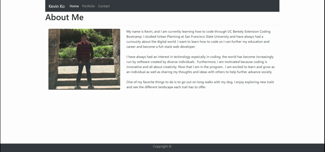

# Responsive Portfolio

Using Bootstrap framework to create a responsive portfolio with a home page, portfolio page and a contact page.

## Built With

- [HTML](https://developer.mozilla.org/en-US/docs/Web/HTML)
- [CSS](https://developer.mozilla.org/en-US/docs/Web/CSS)
- [Bootstrap](https://getbootstrap.com/)

## Demo



## Code Snippets

Each page has a navbar that highlight the page user is currently on

```html
<div class="collapse navbar-collapse" id="navbarNav">
  <ul class="navbar-nav">
    <li class="nav-item active">
      <a class="nav-link" href="#"
        >Home <span class="sr-only">(current)</span></a
      >
    </li>
    <li class="nav-item">
      <a class="nav-link" href="/portfolio.html">Portfoilo</a>
    </li>
    <li class="nav-item">
      <a class="nav-link" href="/contact.html">Contact</a>
    </li>
  </ul>
</div>
```

The portfolio project is display using bootstrap cards

```html
<div class="col-md-4">
  <div class="card" style="width: 18rem;">
    
    <div class="card-body">
      <h5 class="card-title">Workday Scheduler</h5>
      <p class="card-text">
        Workday planner displaying time block from 9am to 5pm
      </p>
      <a
        href="https://kokevin678.github.io/work_day_scheduler/"
        class="btn btn-primary"
        >Demo</a
      >
    </div>
  </div>
</div>
```

## Deployed Link

- [See Live Site](https://kokevin678.github.io/responsive-portfolio/)

## Authors

**Kevin Ko**

- [Portfolio](https://kokevin678.github.io/responsive-portfolio/)
- [LinkedIn](https://www.linkedin.com/in/kevin-ko-ab7a98196/)
- [Github](https://github.com/kokevin678)
